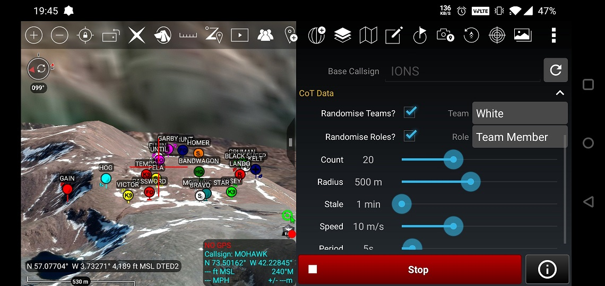
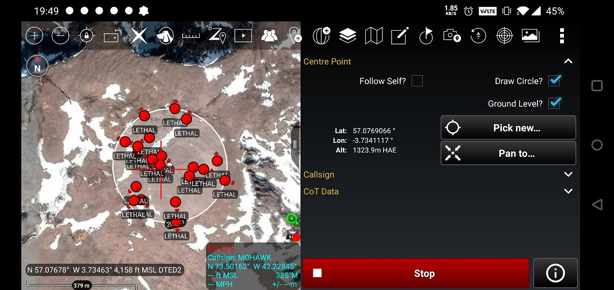
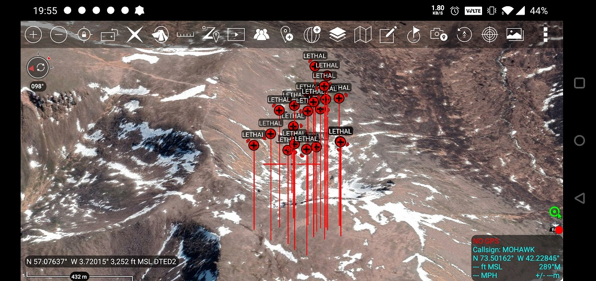
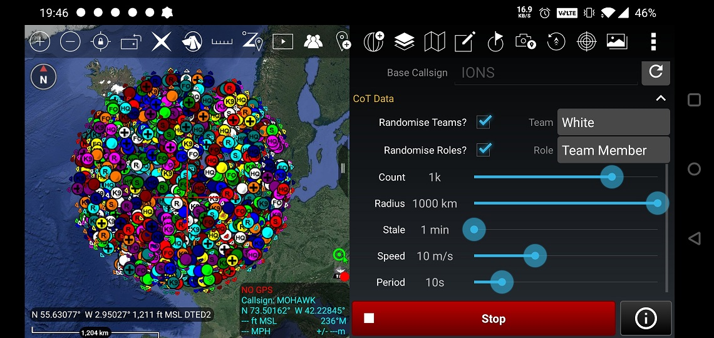
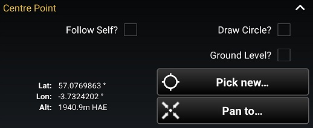
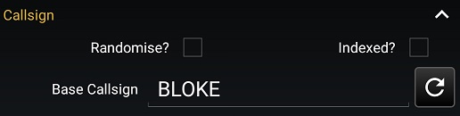
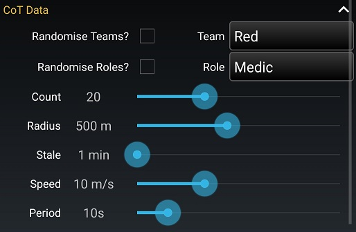

# CoT Generator Plugin

## Summary
This is an ATAK plugin to generate fake Cursor on Target data and send it out over any network you're connected to. This includes UDP mesh networks, TCP servers or localhost machines. It is a port of the [CoT Generator](https://github.com/jonapoul/cotgenerator) Android app, which performs a similar job but with much less integration with ATAK itself, since it's a standalone app.

## Setup
1. Build ATAK-CIV! Follow [this guide](https://www.ballantyne.online/build-an-atak-dev-environment/), although it's slightly out of date as of writing this readme. You may need to change a couple of things to get it building properly. As a second source, try [the official build guide](https://github.com/deptofdefense/AndroidTacticalAssaultKit-CIV/blob/master/BUILDING.md), which is slightly less helpful but may be more up to date. This will take a while (think ~6 hours on a decent PC), so grab a sandwich or two.
2. Install the built ATAK APK on your device.
3. Get the source of this plugin, either by downloading the ZIP from GitHub or `git clone https://github.com/jonapoul/cotgenerator-plugin.git` in a terminal window.
4. Place the keystore that you used to build ATAK into the `keystore/` directory in the project's root directory. This can be either debug or release keystore, so long as it matches that used for ATAK.
5. Open `local.properties` in the project root directory and fill it in as below. If you're only building one variant, you don't need to worry about the passwords/paths for the other variant.
    ```
    sdk.dir=/path/to/your/android/sdk

    takDebugKeyFile=../keystore/debug.keystore
    takDebugKeyFilePassword=<YOUR_FILE_PASSWORD>
    takDebugKeyAlias=<YOUR_KEY_ALIAS>
    takDebugKeyPassword=<YOUR_KEY_PASSWORD>

    takReleaseKeyFile=../keystore/release.keystore
    takReleaseKeyFilePassword=<YOUR_FILE_PASSWORD>
    takReleaseKeyAlias=<YOUR_KEY_ALIAS>
    takReleaseKeyPassword=<YOUR_KEY_PASSWORD>
    ```
6. Place `atak-gradle-takdev-2.0.0.jar` - which should have been created as part of the ATAK build - into the `libs` directory. Also place `main.jar` in here, which is the ATAK SDK library.
7. Run the `assembleDebug` or `assembleRelease` Gradle task to build the plugin APK, then pull the generated APK file out of `cotgenerator-plugin\app\build\outputs\apk\civ\debug` to install on the device and load into ATAK.

## Screenshots
| Mixed icons |
|:--:|
 |

| Overlaid circle to indicate generation zone |
|:--:|
 |

| Flying medics |
|:--:|
 |

| The end is nigh |
|:--:|
 |

## Settings
### Centre Point Settings

| Option | Description |
|--------|-------------|
| Follow self? | Dots will be placed around your ATAK instance's location, and they will follow you around as you move. |
| Draw circle? | A translucent circle will be drawn on the map to show the area within which dots can move. |
| Ground level? | When enabled, all dots will be placed along the ground, which can be pulled from DTED. If disabled, icons can be placed floating in midair, as in one of the screenshots above. |
| Pick new... | Tapping this button will prompt the user to select a centre-point, around which dots will be generated. This can be done quickly by tapping on the map, or long-pressing on the map to manually enter co-ordinates. |
| Pan to... | This button will move the camera to point at the current centre-point, be that a self marker or a manually-picked point. |

### Callsign Settings

| Option | Description |
|--------|-------------|
| Randomise callsign? | Dots will be randomly assigned callsigns from the list of ATAK defaults. |
| Indexed callsign? | Dots will have an index placed after their callsign to differentiate them from the others. This is disabled when randomise is enabled. |
| Base callsign | The callsign given to all dots. Press the refresh button to generate a new one, in case you're not feeling creative. |

### CoT Data Settings

| Option | Description |
|--------|-------------|
| Randomise teams? | Gives each dot a random team colour. |
| Team | Gives each dot the same team colour. |
| Randomise roles? | Gives each dot a random role and corresponding icon. |
| Role | Gives each dot the same role. |
| Count | The number of dots to throw onto the map. This is a logarithmic scale from 1 to 10,000, though I'd expect ATAK to crash by the time it displays 10k icons. Feel free to experiment! |
| Radius | The size of the circle within which to generate dots. This can be visualised by enabling "Draw Circle". Takes a log scale from 1m to 1,000km. |
| Stale | Determines the stale timer of the dots, which sets the time after which they grey out and disappear from the map when inactive. |
| Speed | The movement speed of the dots between each update. |
| Period | The amount of time between each dot's update. |

## Troubleshooting
Note that 100% of testing has been done on a OnePlus 6 running Android 10 and a built-from-source version of ATAK-CIV 4.2.0.0. If there are any compatibility issues or crashes (I'm sure there are), please raise an issue!

## Acknowledgements
Thanks go to:
- [Paul Mandal](https://github.com/paulmandal) for his [ATAK-Forwarder](https://github.com/paulmandal/atak-forwarder) plugin - which I used as a base for this.
- [ATAK Devs](https://github.com/deptofdefense/AndroidTacticalAssaultKit-CIV) for their [hello-world](https://github.com/deptofdefense/AndroidTacticalAssaultKit-CIV/tree/master/plugin-examples/helloworld) plugin template (not to mention the SDK itself!).
- [Simon Ballantyne](https://www.ballantyne.online/) for his excellent [build guide](https://www.ballantyne.online/build-an-atak-dev-environment/) for ATAK-CIV, as well as his two plugin development guides ([one](https://www.ballantyne.online/developing-atak-plugin-101/) and [two](https://www.ballantyne.online/atak-plugin-sdk-something-functional/))
- [Corvo](https://github.com/brothercorvo) and [Field Mapper](https://github.com/fieldmapper) for hosting public [FreeTAKServer](https://github.com/FreeTAKTeam/FreeTakServer) and TAK Server instances for testing.